## To do list

### 1. 프로젝트 설명

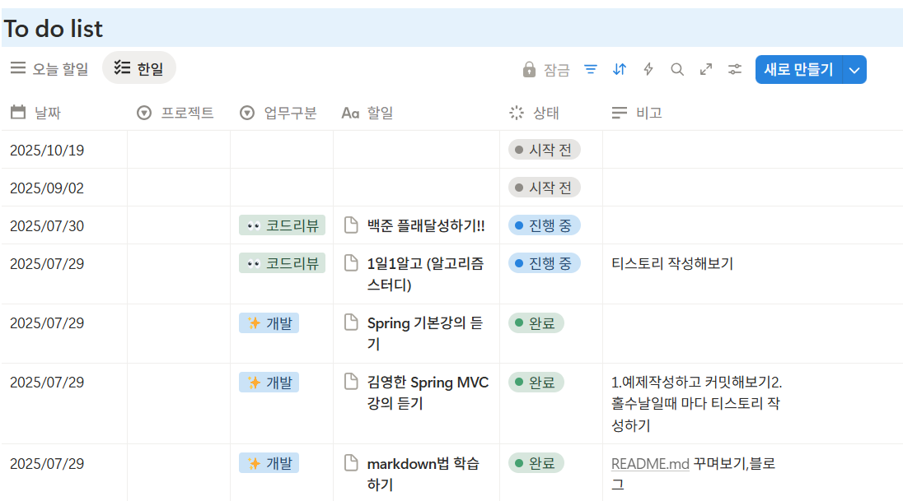

## to do list 클라이언트의 요청에 따라서 API 를 보내주는 서버

### 추가기능

1. 해당 일정에 댓글기능 추가
2. 일정 및, 댓글을 추가할때 password 를 걸어준다
3. 읽기는 password 없이도 가능.
4. 수정, 삭제는 password 검증이 필요

### 2. API 명세서

#### 일정 관리

| 구분         | httpMethod : request(uri)  | status code *(success / fail)*   |
|------------|----------------------------|----------------------------------|
| 등록         | `Post` : /tasks            | 성공 :`201`/ 실패 : `400`,           |
| 전체 조회      | `Get` : /tasks             | 성공 :`200`/ 실패 : `400`        |
| 전체 조회(작성자) | `Get` : /tasks?author=  | 성공 :`200`/ 실패 :  `400`       |
| 선택 조회      | `Get` : /tasks/{taskId}    | 성공 :`200`/ 실패 : `404`, `400`     |
| 수정         | `Put` : /tasks/{taskId}    | 성공 :`200`/ 실패 : `401`,`404`,`400` |
| 삭제         | `Delete` : /tasks/{taskId} | 성공 :`204`/ 실패 : `401`, `404`, `400` |

#### Postman test 결과
##### 1. 등록 `201`
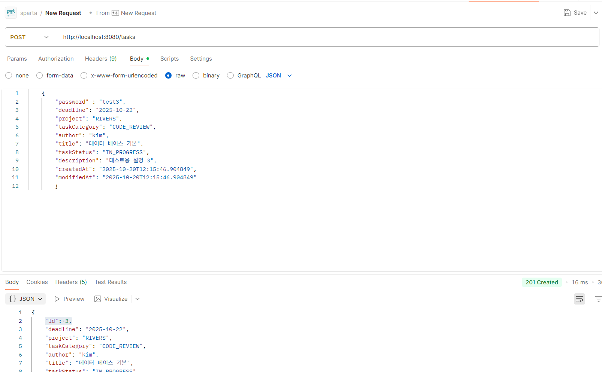
##### 예외 처리 
1. 비밀번호를 빼고 보내는 경우 `400`
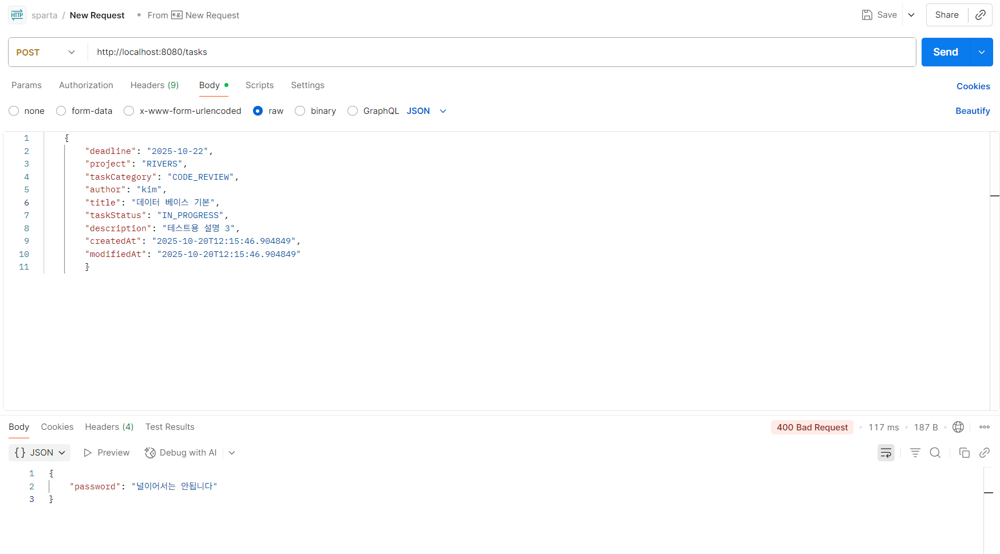
2 1.(통합) 일정 제목 이 30 줄이 넘어가는 경우 `400`
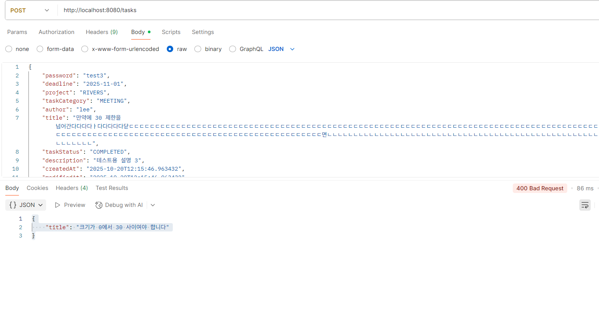
3 1.(통합)  일정 내용 이 200 줄이 넘어가는 경우 `400`
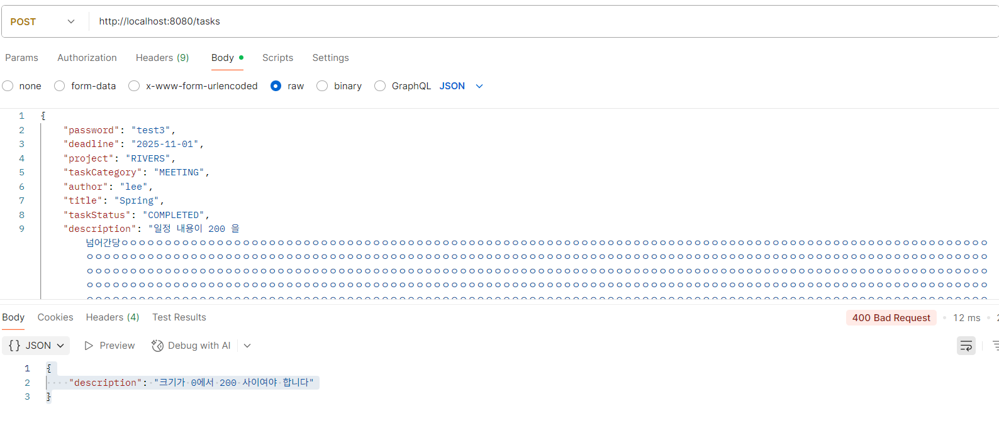
##### 2. 전체 조회 `200` 
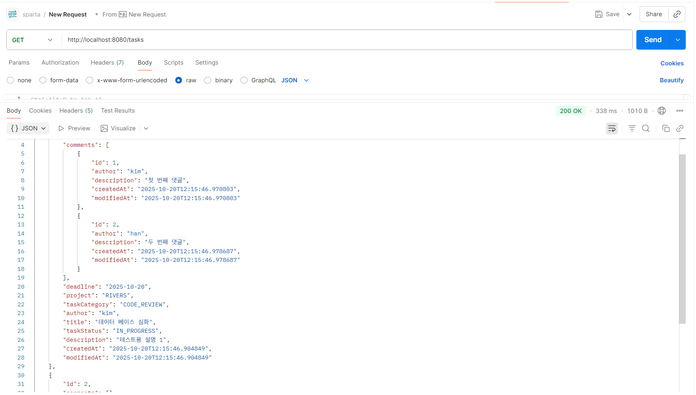
##### 3. 전체 조회(작성자) `200`
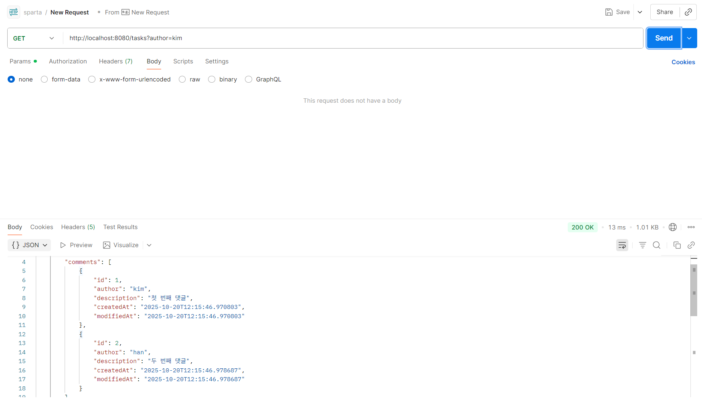
##### 4. 선택 조회 `200`
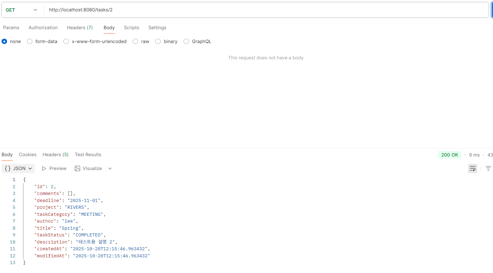
##### 예외 처리 
1. id 가 없는경우 `404`
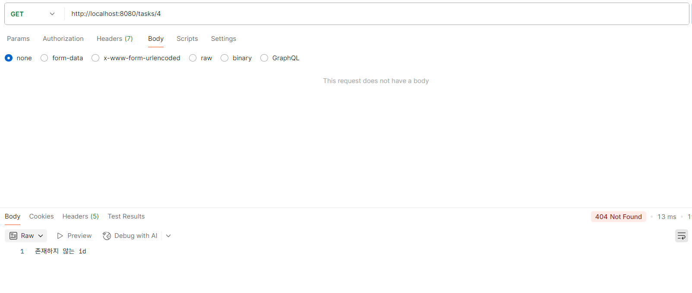
###### 5. 수정 `200`
(title 변경)
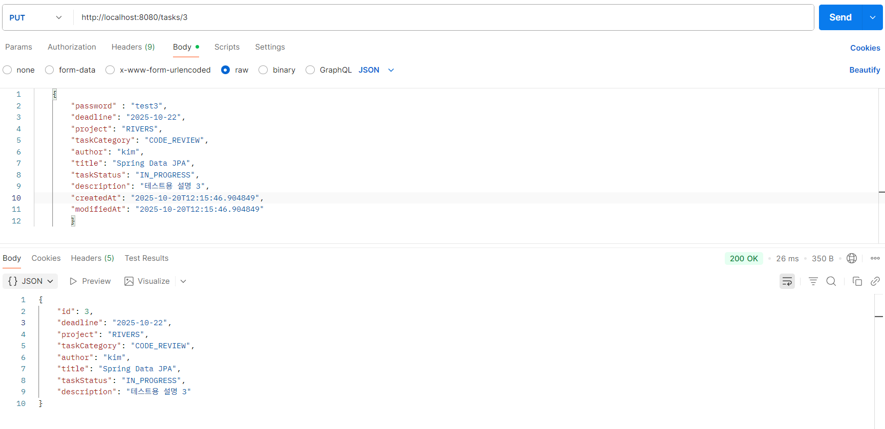
###### 예외 처리
1. 비밀번호를 빼고 보내는 경우 ,또는 데이터 누락 `400`
2. id 가 없는경우 `404`
3. 비밀번호가 맞지 않는경우 401`
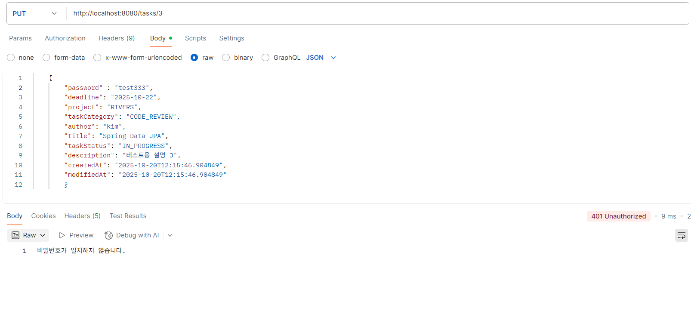
##### 삭제 `204`
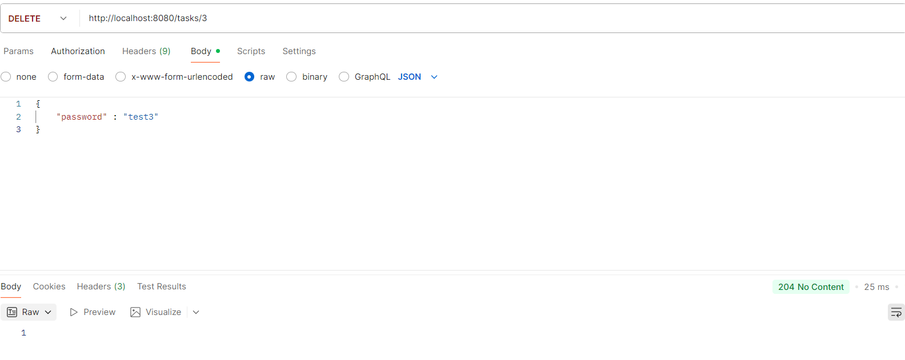
###### 예외 처리
1. 비밀번호를 빼고 보내는 경우 ,또는 데이터 누락 `400`
2. id 가 없는경우 `404`
3. 비밀번호가 맞지 않는경우 `401`
#### 댓글 관리

| 구분         | httpMethod : request(uri)                    | status code *(success / fail)*   |
|------------|----------------------------------------------|----------------------------------|
| 등록         | `Post` :  /tasks/{taskId}/comments           | 성공 :`201`/ 실패 : `400`,           |
| 전체 조회      | `Get` : /tasks/{taskId}/comments             | 성공 :`200`/ 실패 : `400`        |
| 선택 조회      | `Get` : /tasks/{taskId}/comments/{commentId} | 성공 :`200`/ 실패 : `404`, `400`     |
| 수정         | `Put` : /tasks/{taskId}/comments/{commentId} | 성공 :`200`/ 실패 : `401`,`404`,`400` |
| 삭제         | `Delete` : /tasks/{taskId}/comments/{commentId}         | 성공 :`204`/ 실패 : `401`, `404`, `400` |

#### Postman test 결과
##### 1. 등록 `201`
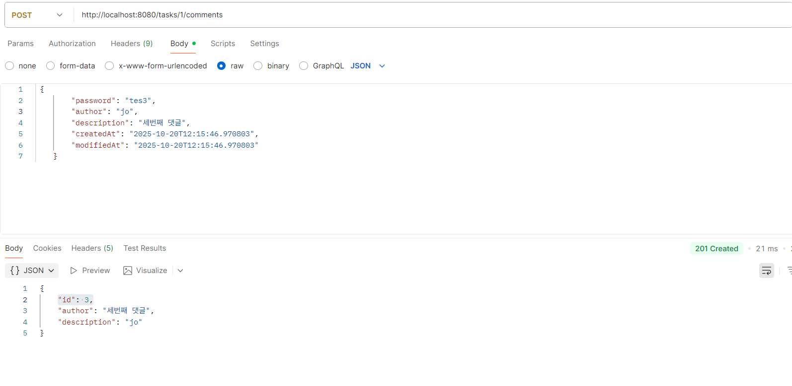
##### 예외 처리
1. 비밀번호를 빼고 보내는 경우 `400`
    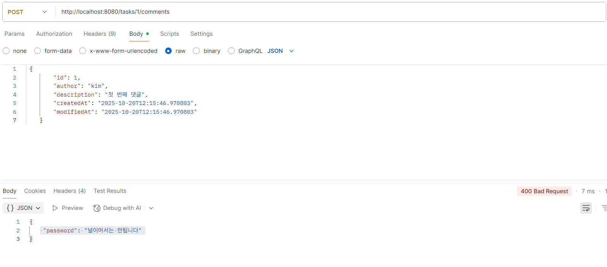
##### 2. 전체 조회 `200`
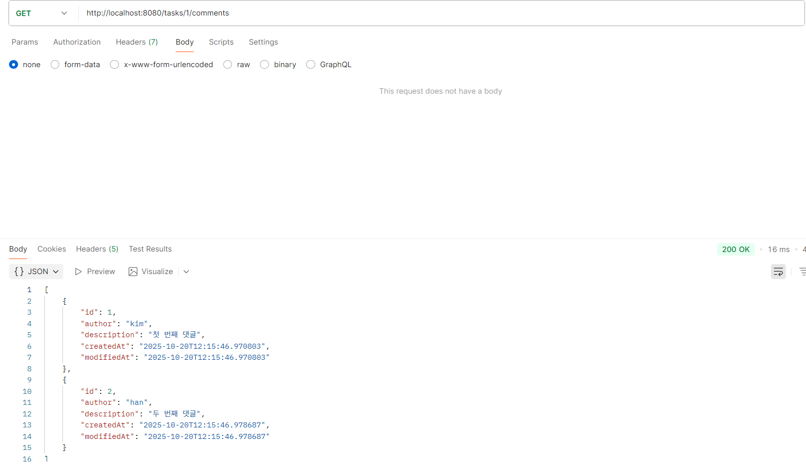
##### 3. 선택 조회 `200`
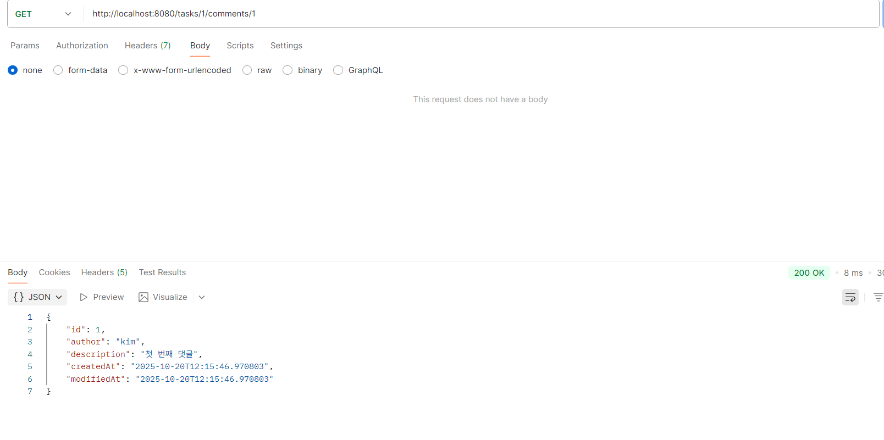
##### 예`외 처리`
1. id 가 없는경우 `404`
###### 4. 수정 `200`
(title 변경)
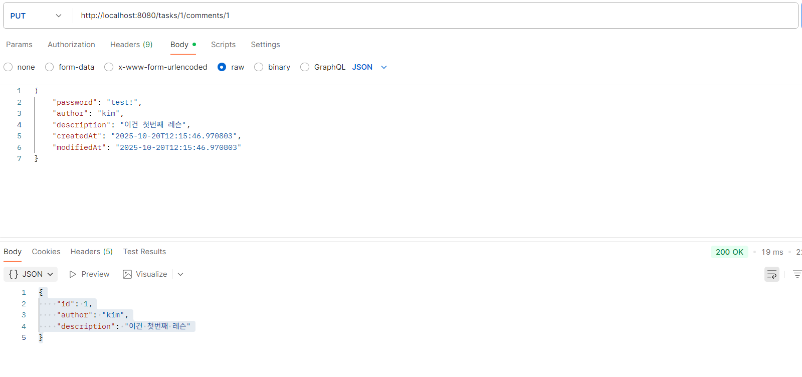
###### 예외 처리
1. 비밀번호를 빼고 보내는 경우 ,또는 데이터 누락 `400`
2. id 가 없는경우 `404`
3. 비밀번호가 맞지 않는경우 `401`
##### 삭제 `204`
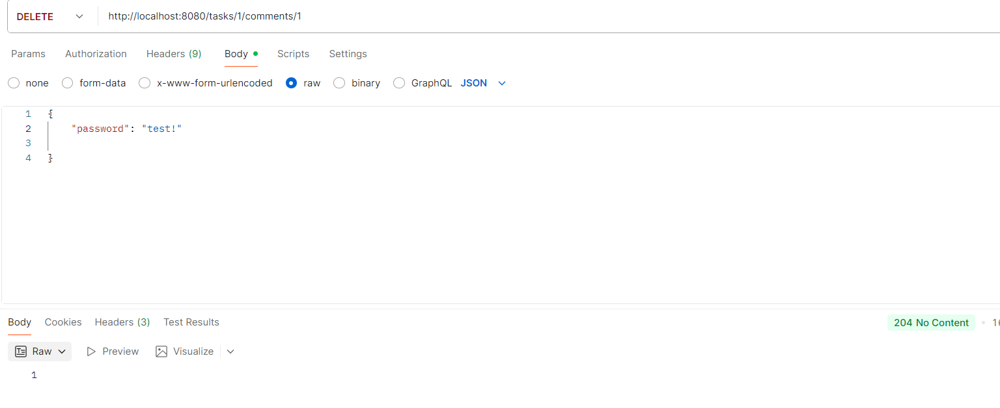
###### 예외 처리
1. 비밀번호를 빼고 보내는 경우 ,또는 데이터 누락 `400`
2. id 가 없는경우 `404`
3. 비밀번호가 맞지 않는경우 401`